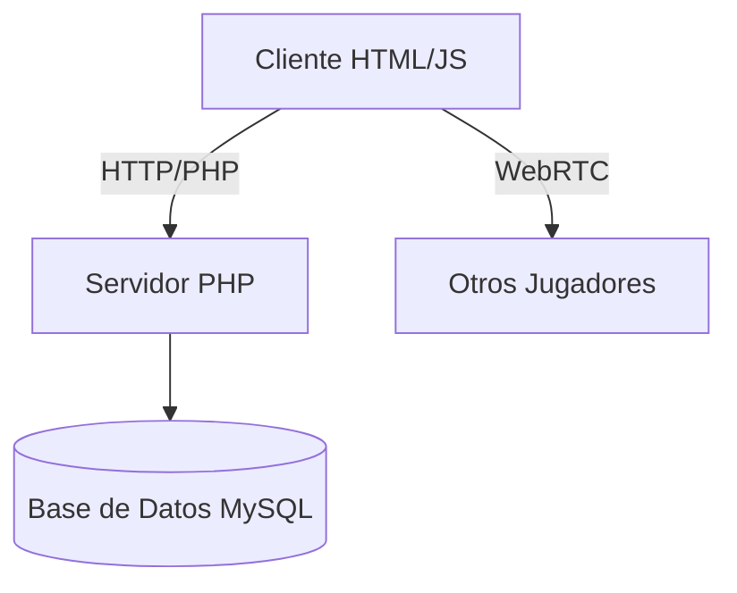
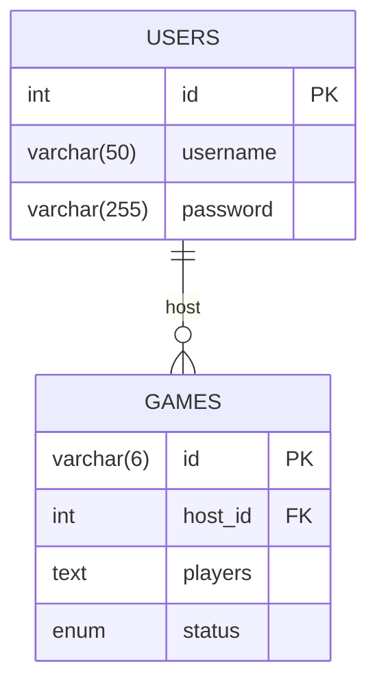
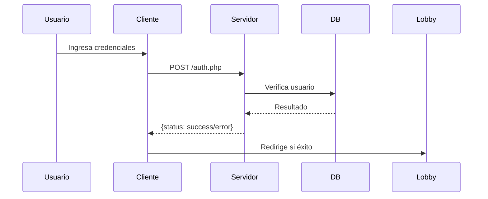
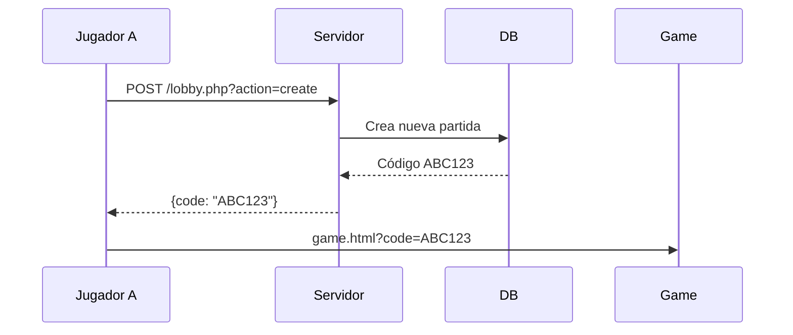
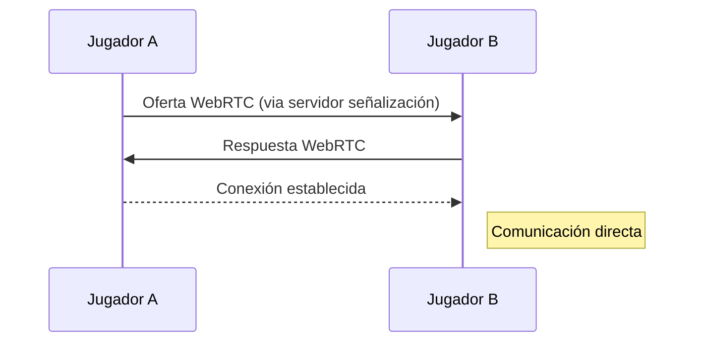
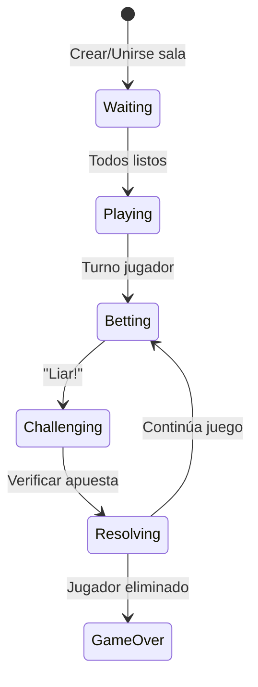

**Documentación Completa: Liars Table (P2P)**
=============================================

**1\. Visión General**
----------------------

**Liars Table** es un juego de dados multijugador basado en el clásico "Liar's Dice", implementado con una arquitectura peer-to-peer (P2P). Los jugadores se conectan directamente entre sí para jugar partidas en tiempo real con autenticación, chat y sincronización de estado.

**2\. Arquitectura del Sistema**
--------------------------------



### **Componentes Clave:**

1.  **Frontend (Cliente):** HTML/CSS/JS puro
    
2.  **Backend (Servidor):** PHP para autenticación y gestión de salas
    
3.  **Base de Datos:** MySQL para usuarios y partidas
    
4.  **Comunicación P2P:** WebRTC (PeerJS) para datos en tiempo real
    

**3\. Estructura del Proyecto**
-------------------------------
```
liars-table/
├── client/                  # Frontend
│   ├── index.html           # Login/Registro
│   ├── lobby.html           # Sala de espera
│   ├── game.html            # Pantalla de juego
│   ├── css/
│   │   └── styles.css       # Estilos
│   └── js/
│       ├── auth.js          # Autenticación
│       ├── lobby.js         # Gestión de salas
│       ├── webrtc.js        # Conexiones P2P
│       ├── chat.js          # Sistema de chat
│       └── game.js          # Lógica del juego
├── server/                  # Backend PHP
│   ├── auth.php             # Autenticación
│   ├── lobby.php            # Gestión de salas
│   ├── game.php             # Lógica del juego (opcional)
│   └── database.php         # Conexión DB
├── database/                # Scripts SQL
│   └── schema.sql           # Esquema de base de datos
└── .gitignore               # Archivos ignorados
└── README.MD                # Documentacion del proyecto
```

**4\. Base de Datos**
---------------------

### **Diagrama Entidad-Relación:**



### **Script SQL (database/schema.sql):**

```
CREATE DATABASE liars_table;
USE liars_table;

CREATE TABLE users (
    id INT AUTO_INCREMENT PRIMARY KEY,
    username VARCHAR(50) UNIQUE NOT NULL,
    password VARCHAR(255) NOT NULL,
    created_at TIMESTAMP DEFAULT CURRENT_TIMESTAMP
);

CREATE TABLE games (
    id VARCHAR(6) PRIMARY KEY,
    host_id INT NOT NULL,
    players TEXT NOT NULL, -- JSON: [1, 2, 3]
    status ENUM('waiting', 'playing', 'finished') DEFAULT 'waiting',
    created_at TIMESTAMP DEFAULT CURRENT_TIMESTAMP,
    FOREIGN KEY (host_id) REFERENCES users(id)
);
```

**5\. Protocolos de Comunicación**
----------------------------------

### **HTTP (Cliente-Servidor):**

| **Endpoint**             | **Método** | **Parámetros**                   | **Respuesta**                             |
|--------------------------|------------|----------------------------------|-------------------------------------------|
| `/server/auth.php`       | POST       | `action, user, password`         | `{status: success/error, ...}`            |
| `/server/lobby.php`      | GET        | `action=list`                    | `{games: [{id, host, players}]}`          |
| `/server/lobby.php`      | POST       | `action=create`                  | `{code: "ABC123"}`                         |
| `/server/lobby.php`      | POST       | `action=join, code=ABC123`       | `{status: success/error}`                 |


### **WebRTC (P2P - Mensajes JSON):**

| **Tipo**    | **Ejemplo**                                                                                             |
|-------------|----------------------------------------------------------------------------------------------------------|
| Chat        | `{type: "chat", from: "Ana", text: "¿Cuántos dados tienes?"}`                                           |
| Apuesta     | `{type: "bet", player: "Bob", bet: "three-4"}`                                                          |
| Desafío     | `{type: "challenge", challenger: "Carlos", challenged: "Ana", result: true}`                            |
| Estado      | `{type: "state", players: [{name: "Ana", dice: 5}, ...], turn: "Bob"}`                                  |


**6\. Flujos de Trabajo**
-------------------------

### **Autenticación:**



### **Creación de Sala:**



### **Conexión P2P:**



**7\. Lógica del Juego (Liars Dice)**
-------------------------------------

### **Reglas Básicas:**

1.  Cada jugador comienza con 5 dados
    
2.  Turnos para hacer apuestas (ej: "tres 4s")
    
3.  Jugadores pueden:
    
    *   Subir la apuesta
        
    *   Desafiar ("Liar!"): Se revelan dados
        
4.  Quien pierde desafío pierde un dado
    
5.  Último jugador con dados gana
    

### **Estados del Juego:**



**8\. Configuración del Entorno**
---------------------------------

### **Requisitos:**

*   XAMPP (Apache + MySQL + PHP)
    
*   Navegador moderno (Chrome, Firefox)
    
*   Git (opcional)
    

### **Pasos de Instalación:**

1.  Instalar XAMPP
    
2.  Clonar repositorio en **C:\\\\xampp\\\\htdocs\\\\rocketraccoon**
    
3.  Iniciar Apache y MySQL en XAMPP
    
4.  Importar **database/schema.sql** en phpMyAdmin
    
5.  Acceder a **http://localhost/rocketraccoon/client/index.html**
    

**9\. Pruebas**
---------------

### **Casos de Prueba Clave:**

| **Escenario**             | **Entrada**                      | **Resultado Esperado**                |
|---------------------------|----------------------------------|---------------------------------------|
| Registro nuevo usuario    | user: "ana", pass: "123"         | DB: usuario creado                    |
| Login exitoso             | user: "ana", pass: "123"         | Redirección a lobby                   |
| Creación de sala          | Jugador hace click               | Código único generado                 |
| Unión a sala existente    | Ingresa código válido            | Entra a sala de juego                 |
| Envío mensaje chat        | Texto + Enter                    | Mensaje aparece en todos              |
| Apuesta válida            | "two-3"                          | Turno pasa al siguiente               |
| Desafío exitoso           | "Liar!" + apuesta falsa          | Jugador perdedor pierde dado          |


**10\. Despliegue**
-------------------

### **Hosting Gratuito:**

1.  **Frontend:** GitHub Pages
    
    *   Subir carpeta **client/** a repositorio
        
    *   Activar GitHub Pages en settings
        
2.  **Backend:** 000webhost (PHP/MySQL)
    
    *   Subir carpeta **server/**
        
    *   Crear base de datos e importar **schema.sql**
        
3.  **Configurar URLs:**